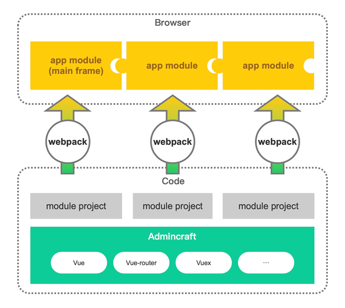
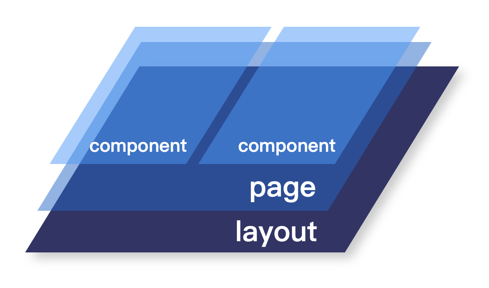

# 指南

::: warning
开始使用 Admincraft 前，我们假设您已经拥有了创建或使用 vue + webpack 工程的开发经验。
:::

Admincraft，名称借鉴自“Minecraft”。也是希望 Admincraft 能够像“Minecraft”一样成为一个灵活自由强大的开发工具，为中后台应用的快速开发寻找新的可能。

Admincraft 在 Vue 已有 API 的基础上进行了更高级的 API 封装。令 Admincraft 支持除传统的单一工程开发外也支持模块化分离开发，开发完成的模块可以分布部署，并在另一个模块运行时热加载到主系统中。



:::tip
Admincraft 做了很多的约定和预设，如果您只是想简单的拥有加载远程模块的能力，不妨只使用[vue-module-loader](https://github.com/mqhe2007/vue-module-loader)试试看。
:::

欢迎进群交流。


## 内置工具库

Admincraft 内置了下列工具库，无需再次安装。

- [vue](https://cn.vuejs.org)

- [vue-meta](https://vue-meta.nuxtjs.org/)

- [vue-router](https://router.vuejs.org/zh/)

- [vuex](https://vuex.vuejs.org/zh/)

- [axios](https://github.com/axios/axios)

- [better-scroll](https://github.com/ustbhuangyi/better-scroll)

## 视图层次

为了使应用的页面布局灵活多变，不局限为单一的控制台布局，Admincraft 自带的用户界面采用了`布局 > 页面 > 组件`的层级结构。如下图：



### 布局

布局是系统最顶层的[路由出口](https://router.vuejs.org/zh/guide/essentials/nested-routes.html)。通过配置 Admincraft 布局，可以实现：控制台，空页面，错误等页面。

在[路由选项](/options/#路由选项配置)中未配置`layout`选项时，Admincraft 默认布局名称为`layoutDefault`，会输出“布局未找到提示”，并且子路由页面不会被输出。

可以使用 [添加布局](/api/#app-addlayout) API 设置同名布局进行重设。

### 页面

页面是路由渲染的目标组件，相当于传统项目中的`html`页面，一个页面由若干个组件联合构成。

### 组件

这里所说的组件是指除布局，页面这些专用组件外，其他的`.vue`单文件组件。

## Admincraft 实例

每个应用或模块都是通过`Admincraft`类创建一个新的 Admincraft 实例开始的，Admincraft 实例本质上是一个增强了 API 的 Vue 实例，同时具备 Vue 实例的所有属性和方法（有待尝试）。

```javascript
let admincraft = new Admincraft({
  // 选项
})
```

当创建一个 Admincraft 实例时，你可以传入一个选项对象作为实例化配置，详细选项请查看[实例化选项](/options/#实例化选项)。

### 挂载实例

做完了以上那些内容，如果你启动一个开发服务，发现并不能在浏览器窗口中看到内容。因为当我们实例化 Admincraft 后仅仅是得到了一个存在于浏览器文档之外的实例对象：`admincraft`。我们接下来要做的就是使用 Vue 实例方法`$mount`把 Vue 实例挂载到一个 DOM 元素上。[学习\$mount](https://cn.vuejs.org/v2/api/#vm-mount)

通常代码看起来是这个样子：

```javascript
let el = document.createElement('div')
document.body.appendChild(el)
/**
 * 是否新建元素取决于你想怎么做，如果你想挂载实例到一个已存在于你index.html文件中的元素上。
 * $mount方法同样可以接收一个选择器字符串作为参数。
 **/
let admincraft = new Admincraft({
  theme: {
    title: '应用名称'
  }
})
admincraft.$mount(el)
```

刷新浏览器，此时应该可以看到 admincraft 的默认界面了。

### 路由配置

通常我们使用 Vue 来做项目，实例化的同时就会传入 vue-router 配置。Admincraft 也是这么做的，只不过是发生在 Admincraft 内部，我们并不需要关心细节，而且借助于`addRoutes`API，我们可以在实例化之后再添加路由配置。

通常我们新建一个路由配置文件，导出符合路由规范的数组。

:::tip
路由的 name 在 Admincraft 中非常重要。我们使用 name 进行路由导航，匹配菜单，匹配页签等，一定要记得配置，并且具有唯一性。
:::

```javascript
// routes.js
import Login from './views/Login.vue'
export default [
  {
    path: '/login',
    name: 'login',
    meta: {
      NonMenu: true,
      title: '请登录',
      layout: 'blank'
    },
    component: Login
  },
  ...
]
```

:::tip
**这里有个特殊情况：**
如果您使用了`admincraft-ui`模块，为了实现[动态可变的控制台首页](/ui/#首页配置)，`/`根路由，已经在`admincraft-ui`内部配置过了，请不要再次配置。
:::

路由配置可以在[模块初始化函数](/guide/#模块是什么)中使用原型方法`$addRoutes`进行加载，也可以在 Admincraft 实例化后使用实例方法`$addRoutes`加载。

### 状态配置

情况和路由配置类似，并且使用了[Vuex 模块](https://vuex.vuejs.org/zh/guide/modules.html)的概念，您必须掌握其使用方法。

通常我们新建一个 Vuex 模块配置文件。

```javascript
// store.js
const storeModule = {
  state: { ... },
  mutations: { ... },
  actions: { ... },
  getters: { ... }
}
export default storeModule
```

加载方式和路由配置同理，请参考 API。

### 使用 Vue 插件

在实例化之前使用全局 API：[Admincraft.use](/api/#admincraft-use)进行加载。

## 加载一个模块

在 Admincraft 项目中我们有两种方式加载模块。

### 实例化前加载

Admincraft 实例化前可以通过[Admincraft.add](/api/#admincraft-add)方法添加一个模块。

### 运行时加载

应用运行时在任何时候可以通过实例方法[\$moduleLoader](/api/#app-moduleloader)进行加载。

## 编写一个模块

### 模块是什么

文件导出一个接收 Admincraft 实例上下文对象的函数，并且在函数内部合并数据的都算是一个模块。我们通常使用`/src/module-init.js`文件作为模块 build 入口文件。

```js
// /src/module-init.js
import LayoutFrame from '@/layout/Frame'
import routes from '@/router/routes.js'
import storeModule from './store'
export default ({ Vue }) => {
  Vue.prototype.$addLayout({ layoutDefault: LayoutFrame })
  Vue.prototype.$addRoutes(routes)
  Vue.prototype.$addStore('moduleName', storeModule)
  Vue.prototype.$addMenus(routes)
}
```

借助于[Vue-cli](https://cli.vuejs.org/zh/)脚手架工具创建模块工程，我们很容易的把代码打包成一个 Admincraft 模块。

一个 Admincraft 模块就是一个打包成 umd 规范的 js 库及相关资源。

打包为库的配置请参考：[构建目标-库](https://cli.vuejs.org/zh/guide/build-targets.html)

这里有一个带有完整演示的模块项目：[admincraft-showcase](https://github.com/mqhe2007/admincraft-showcase)

### 目录约定

:::tip
注意，缩进代表目录层级。
:::

```
dist ----------------- 编译完成后的发行代码目录
node_modules --------- nodejs项目依赖安装目录
public --------------- 不需要webpack打包的静态资源目录
  libs --------------- 通过远程调用的第三方库目录
  index.html --------- 开发预览的网页入口文件
src ------------------ 源代码目录
  assets ------------- 需要webpack打包编译的资源目录
  components --------- 局部组件目录
  layout ------------- 布局组件目录
  router ------------- 路由配置目录
    routes.js -------- 路由配置
  store -------------- vuex状态管理配置
    storeModule.js --- vuex状态模块化配置
  views -------------- 视图组件目录，需要导入路由配置
  App.vue ------------ Vue实例根组件
  envConst ----------- 多环境常量配置
  init.js ------------ 模块初始化文件，模块化打包的入口文件
  libs.js ------------ 通过远程调用的第三方库清单文件
  main.js ------------ 开发服务入口文件
.browserslistrc ------ 浏览器支持情况配置
.env.* --------------- 构建环境与模式配置
.eslintrc.js --------- eslint的配置文件
.gitignore ----------- git 提交忽略文件
babel.config.js ------ babel编译配置文件
package.json --------- npm包配置文件
postcss.config.js ---- postcss样式处理配置文件
README.md ------------ 自述文件
vue.config.js -------- vue-cli配置文件
yarn.lock ------------ npm依赖版本锁
```

### 依赖安装

#### 公共依赖

公共依赖是指大部分模块都要用到的依赖库，例如统一的 UI 组件库。这类公共依赖会在主框架模块中安装，业务模块开发时只需优先加载主框架模块，无需额外安装公共依赖。

#### 私有依赖

私有依赖是指只有业务模块自己要使用的依赖库。安装后导入为局部变量使用。

### 模块打包

下面是一个完整的模块打包入口例子：

```javascript
// /src/module-init.js
// 导入模块数据
import routes from './router/routes'
import storeModule from './store/storeModule'

// 从package.json中获取模块名称
let moduleName = require('../package.json').name

// 导出模块初始化函数
export default context => {
  // 注册路由
  context.vue.prototype.$addRoutes(routes, () => {
    console.log(moduleName + '：路由注册完成')
  })

  // 注册状态树
  context.vue.prototype.$addStore(moduleName, storeModule, () => {
    console.log(moduleName + '：状态注册完成')
  })

  // 注册菜单
  context.vue.prototype.$addMenus(routes, () => {
    console.log(moduleName + '：菜单注册完成')
  })
}
```

### 模块部署

一个使用 nginx+jenkins 的模块部署过程如下：

#### 1. 新建模块虚拟机

在部署服务器中找到 nginx 虚拟机配置目录`*/**/nginx/conf/vhost`。

创建模块的`vhost`配置文件。

着重以下配置：

```shell
server{
  # 监听端口号。
  listen 8081;
  location / {
    # 虚拟机根目录，以模块名命名，用以存放构建生成的文件。
    root /home/apps/<module_name>;
  }
}

```

#### 2. 配置构建脚本

登录 jenkins 构建工具创建新任务。

##### 执行 shell 第一步

本段 shell 主要是模块打包命令，打包过程根据自己模块`package.json`中实际的脚本进行配置。

```shell
node -v
yarn -v
yarn
yarn build
```

##### 执行 shell 第二步

把第一步打包完成的代码转移到部署服务器模块的虚拟机中。

```shell
ssh user@xxx.xxx.xxx.xxx "cd /home/apps
rm -rf <module_name>
mkdir <module_name>"
scp -r ${WORKSPACE}/dist/* user@xxx.xxx.xxx.xxx:/home/apps/<module_name>
```

#### 3. 验证模块地址

等待 jenkins 任务执行完毕，尝试访问`http://xxx.xxx.xxx.xxx:8081/<module_name>.umd.js`，如果能访问成功，既模块部署成功。

### 模块开发

从上文可知，代码打包成一个 Admincraft 模块可以用一个导出函数的入口文件`module-init.js`来实现。那作为一个 Admincraft 模块，我们如何去运行开发呢？

其实很简单，像传统的 Vue 工程一样，我们从`main.js`文件出发。我们只需要在我们的 `main.js` 文件中导入模块要导出的初始化函数（`module-init.js` ）和 `Admincraft`，我们当前开发服务所运行的代码就是一个 Admincraft 项目，我们就可以使用 Admincraft 创建实例，并在[实例化前添加我们的模块](/api/#admincraft-add)。

```javascript
// main.js
import Admincraft from 'admincraft'
import showCase from './init'
// 添加一个模块
Admincraft.add(showCase)
// 创建实例
let appElement = document.createElement('div')
let app = new Admincraft({
  title: 'Showcase',
  logo: { text: 'showcase演示' }
})
app.$mount(appElement)
document.body.appendChild(app.$el)
```

然后，就能正常开发了，任何模块相关代码改动都会及时的更新在实例中。

这样在开发阶段既能同步使用 Admincraft 提供的 API，组件，布局等能力，又能保证开发出的模块能完美被其他 Admincraft 项目加载。

## 事件总线

为了提高模块与模块，模块与框架之间通信的灵活性，Admincraft 特别引入了事件总线。

事件总线本质上是 Vue 原型对象上的一个对象 `eventBus`，我们可以用来监听和触发一些事件。

每个模块需要提供自己的[事件列表](/appendix/#事件列表)以供其他模块监听。反之，也可根据其他模块提供的事件列表按需监听。

:::tip
为表明事件的不变性，Admincraft 约定使用常量标识事件名称，事件名称多个单词通过下划线`_`连接。
:::

### 触发事件

我们使用\$eventBus.emit()方法可以触发一个自定义事件。

```javascript
this.$eventBus.emit('EVENT_NAME', payloadData)
```

### 监听事件

我们使用\$eventBus.on()方法可以监听一个自定义事件，同一个事件可以重复监听多次。

```javascript
this.$eventBus.on('EVENT_NAME', payloadData => {})
```

### 取消监听

我们使用\$eventBus.off()方法可以监听一个自定义事件。

```javascript
this.$eventBus.off('EVENT_NAME')
```

## 发起异步请求

根据业务接口发起异步请求获取数据，是前后端分离的系统最重要的功能之一。Admincraft 内部封装了强大易用的 http 网络请求库[axios](https://github.com/axios/axios)，并在实例化时赋化身为`$http`对象，我们使用`$http`发起请求就像使用 axios 一样，例如：

```js
this.$http
  .get('api/path', {
    params: {}
  })
  .then(data => {
    console.log(data)
  })
```

除了在 Admincraft 实例化时可以传入 http 配置，我们在使用实例方法`$http`时也可以随时修改请求配置，发起请求时传入的配置优先级大于实例化配置。

```js
this.$http
  .get('api/path', {
    params: {},
    timeout: 5000 // 当前接口的超时时间就会延长至5000ms
  })
  .then(data => {
    console.log(data)
  })
```
